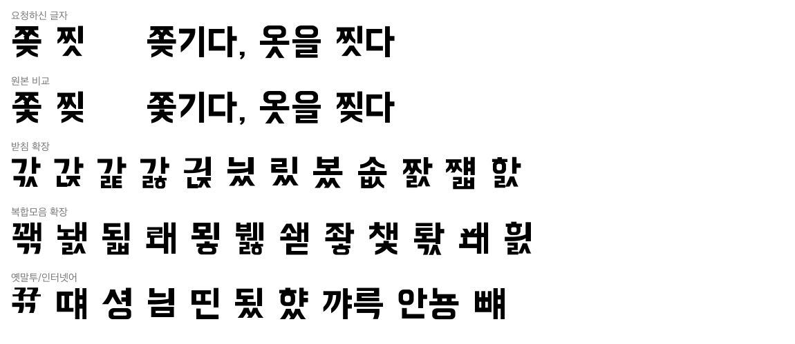

# BMHANNAPro Hangul11172

배달의민족 한나체(BM HANNA Pro)를 **모든 한글 11,172자**가 나오도록 보완한 비공식 완성판 폰트입니다.

원본 한나체는 자주 쓰는 2,518자에만 실제 글자가 있어 `쫒`, `찟`, `떄`, `뀪` 같은
글자를 입력하면 빈 칸이나 음식 그림으로 표시됩니다. 이 폰트는 그 빈자리 8,798자를
원본 글자에서 추출한 자음·모음 조각으로 조립해 채웠습니다.
원래 있던 글자 2,374자는 1픽셀도 수정하지 않았습니다.

> 이 저장소는 우아한형제들·산돌과 무관한 비공식 파생본이며, 문제 시 배포를 중단합니다.

## 목차

- [이 저장소가 제공하는 것](#이-저장소가-제공하는-것)
- [Windows 설치 방법](#windows-설치-방법)
- [macOS 설치 방법](#macos-설치-방법)
- [자주 묻는 질문](#자주-묻는-질문)
- [만든 방법](#만든-방법)
- [기여](#기여)
- [라이선스](#라이선스)
- [크레딧](#크레딧)

## 이 저장소가 제공하는 것

**완성된 폰트 파일(TTF) 자체를 배포합니다.** 다운로드해서 설치하면 바로 쓸 수 있습니다.
원본 폰트를 따로 구하거나 무언가를 빌드할 필요가 없습니다.

| 경로 | 내용 | 대상 |
|---|---|---|
| [Releases](../../releases) / `BMHANNAPro_Hangul11172.ttf` | 완성된 폰트 | 모든 사용자 |
| `install-windows.bat`, `install-macos.command` | 선택사항인 설치 도우미 | 모든 사용자 |
| `src/` | 폰트를 만들 때 사용한 파이썬 도구 | 개발자·커스터마이징 |
| `docs/REPORT.md` | 제작 과정 기록 | 궁금한 사람 |

## Windows 설치 방법

1. [여기를 클릭](../../releases)하세요. (이 저장소 첫 화면 오른쪽의 "Releases"와 같은 곳입니다)
2. 열린 페이지에서 `BMHANNAPro_Hangul11172.ttf` 라고 적힌 부분을 클릭하면 다운로드됩니다.
   보통 "다운로드" 폴더에 저장됩니다.
3. 다운로드한 ttf 파일에 마우스 오른쪽 버튼 → **"모든 사용자용으로 설치"** 를 누르세요.
   (메뉴에 없으면 더블클릭 → 왼쪽 위 [설치] 버튼)
4. 메모장을 열어 서체 목록에서 "BMHANNAPro Hangul11172"를 선택하고
   `쫒기다, 옷을 찟다` 를 입력해보세요. 모든 글자가 보이면 성공입니다.
5. 글자가 안 보이면 PC를 한 번 재부팅한 뒤 다시 확인하세요.

## macOS 설치 방법

1. [여기를 클릭](../../releases)하세요. (이 저장소 첫 화면 오른쪽의 "Releases"와 같은 곳입니다)
2. 열린 페이지에서 `BMHANNAPro_Hangul11172.ttf` 라고 적힌 부분을 클릭하면 다운로드됩니다.
   보통 "다운로드" 폴더에 저장됩니다.
3. 다운로드한 ttf 파일을 더블클릭 → [설치] 버튼을 누르세요.
4. 사용하던 앱(메모 등)을 완전히 종료(Cmd+Q)한 뒤 다시 여세요.
5. 메모 앱에서 서체 목록의 "BMHANNAPro Hangul11172"를 선택하고
   `쫒기다, 옷을 찟다` 를 입력해보세요. 모든 글자가 보이면 성공입니다.

## 자주 묻는 질문

**1. 원래 한나체에서는 왜 글자가 안 보였나요?**

버그가 아니라 원본 폰트의 의도된 컨셉이었습니다. 공식 소개는 다음과 같습니다:

> "배달의민족 한나체 Pro는 맛있는 음식 이미지가 구석구석 숨어있는 서체입니다.
> 한글 조합은 되지만 실제로는 잘 쓰이지 않는 글자를 음식 이미지로 대체하여
> 타이핑할 때 뜬금없이 음식 그림이 뿅! 나왔다 사라집니다." — [우아한형제들](https://www.woowahan.com/fonts)

**2. 그럼 이 폰트는 원본과 정확히 뭐가 다른가요?**

| | 원본 BM HANNA Pro | 이 완성판 |
|---|---|---|
| 자주 쓰는 글자 2,374자 | 디자이너가 그린 글자 | 동일 (수정 없음) |
| 희귀 글자 144자 (옧, 똠 등) | 음식 그림 | 진짜 한글 |
| 나머지 8,654자 (쫒, 찟 등) | 빈 칸 | 진짜 한글 |
| 일부 특수기호 | 없음 | D2Coding에서 보강 |

타이핑 중 음식 그림이 나오는 일은 없습니다 (한글 11,172자 전수 검증 완료).
음식 그림 이스터에그를 원하면 [공식 한나체 Pro](https://www.woowahan.com/fonts)를 사용하세요.

**3. 품질은 원본과 동일한가요?**

조립된 글자는 실제 한나체 획으로 만들어 스타일은 일관되지만, 디자이너가 한 자씩
그린 원본만큼의 미세 조정은 없습니다. 복합모음+겹받침의 극희귀 조합은 받침이
다소 비좁아 보일 수 있습니다.

**4. 이상하게 보이는 글자를 발견했어요.**

[이슈](../../issues)로 알려주세요. 어떤 글자인지, 어디서 봤는지만 적으면 됩니다.

## 만든 방법

1. 원본의 글자 2,374자를 초성·중성·종성으로 자동 분리
   (폰트에 내장된 호환 자모 51자를 기준 모양으로 채점)
2. 누락 글자별 최적 전략으로 조립:
   받침교체(`쫒` = `쫄`의 ㅉㅗ + `곶`의 ㅈ받침) → 초성교체 → 모음교체(`뺴` = `빼`의 ㅐ→ㅒ) → 압축+받침추가 → 완전조립
3. 11,172자 전수 렌더링 검증 + AI 멀티에이전트 시각 검수 5라운드

상세 기록은 [docs/REPORT.md](docs/REPORT.md), 재실행 가능한 파이프라인은 [src/](src/) 참고.

## 기여

이슈는 자유 양식입니다 — "이 글자가 안 돼요" 한 줄이면 충분합니다.
글자 수정 PR도 환영합니다 (`src/` 파이프라인 참고).

## 라이선스

- **폰트**: [배달의민족 글꼴 라이선스](LICENSE-FONT.txt) — 수정·재배포·상업적 사용 허용,
  폰트 파일 자체의 유료 판매 금지. (원문: [woowahan.com/fonts](https://www.woowahan.com/fonts))
- **D2Coding 유래 기호**: [SIL OFL 1.1](OFL-D2Coding.txt)
- **`src/` 파이썬 도구**: MIT

## 크레딧

- 원본 폰트: **BM HANNA Pro** — Woowa Brothers Corp.(우아한형제들), 제작 산돌커뮤니케이션
- 특수기호 일부: **D2Coding** — NAVER
- 이 완성판은 위 원본을 보완한 비공식 파생본입니다
